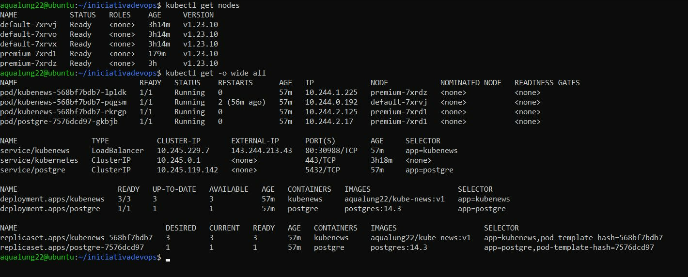

# Automating IaC with Terraform and Kubernetes Cluster Deployment on Digital Ocean

## Table of Contents

1. [Introduction](#introduction)
2. [Prerequisites](#pre-requisites)
3. [Installation](#infrastructure-setup)
4. [Prerequisites](#deployment-configuration)
5. [Prerequisites](#terraform-configuration)
4. [Usage](#usage)

## Introduction
This project uses Terraform, an Infrastructure as Code (IaC) tool, to provision a Kubernetes cluster on Digital Ocean. Once the infrastructure is set up, it deploys [Kube-news](https://github.com/KubeDev/kube-news), a Node.js sample application, onto the cluster.

## Pre requisites

To interact with your Kubernetes cluster, you need to have `kubectl` installed. Here are the steps to install `kubectl` on your Linux machine:

1. **Download the latest release**:
   - https://kubernetes.io/docs/tasks/tools/#kubectl

2. **Make the kubectl binary executable**: `chmod +x ./kubectl`
3. **Move the binary in to your PATH**: `sudo mv ./kubectl /usr/local/bin/kubectl`
4. **Test to ensure the version you installed is up-to-date**: `kubectl version --client`

Please replace the URLs in the commands with the latest ones from the official Kubernetes documentation.

## Infrastructure Setup

In this project, I used Hashicorp's Terraform to implement the Infrastructure as Code (IaC) concept, which allowed us to build, change, and version infrastructure safely and efficiently. I chose Digital Ocean as the cloud provider for this project.

I declared the IaC using Hashicorp's proprietary HCL (Hashicorp Configuration Language). With HCL, I declared blocks of the following types:

- **Resource**: Creation of an element managed by Terraform
- **Data Source**: Access to APIs and other Terraform states
- **Provider**: Plugins, called providers, that allowed connection with cloud providers, APIs, and others
- **Variable**: Definition of variables
- **Output**: Display of data in the console output

I set up the Digital Ocean cloud provider to establish a connection between my local Linux console and the cloud.

I declared the initial infrastructure configuration with a standard Size resource and applied it. Then, I added a Premium Node pool and applied it  through hot swapping.

Code Reusability and Parameterization:
I extracted the access token, Kubernetes cluster name, and cloud provider region to a separate file for better code reusability and parameterization.

I installed a local provider to obtain the Kubectl configuration file from Digital Ocean for remote cluster manipulation.

Deployment:

I deployed a NodeJs application and a PostgreSQL database on a Kubernetes cluster.

I checked the state of nodes, pods, service, deployment, load balancer and confirmed external access to the application through the browser.

## Terraform Configuration

The `main.tf` file contains the configuration for the Digital Ocean provider and the resources required for the Kubernetes cluster. It also includes  variable declarations for the Digital Ocean token, Kubernetes cluster name, and region.

The output displayed the Kubernetes endpoint.

I used a local file resource to obtain the Kubectl configuration file from Digital Ocean.

## Deployment Configuration

The `deployment.yaml` file contains the configuration for deploying a PostgreSQL database and a NodeJs application on the Kubernetes cluster. It also included service configurations for both PostgreSQL and NodeJs application with a LoadBalancer type for the NodeJs application.

Please replace placeholders in `main.tf` with your actual values before running `terraform apply`.

## Usage

1. Install [Terraform](https://www.terraform.io/downloads.html) - https://www.terraform.io/downloads.html on your local machine.
2. Clone this repository.
3. Navigate to the project directory.
4. Run `terraform init` to initialize your Terraform workspace.
5. Replace placeholders in `main.tf` with your actual values.
6. Run `terraform apply` to create your infrastructure.
7. Once your infrastructure is created, you can deploy your applications using `kubectl apply -f deployment.yaml`.

## Results

## Security Issues

To address security issues, you should avoid hardcoding sensitive data directly into your files. Instead, consider the following solutions:

Environment Variables: Store sensitive data in environment variables on the system where your code is executed. This keeps the sensitive data out of your codebase and can be easily changed.

Secrets Management Tools: Use tools like HashiCorp’s Vault. This kind of tool keeps your sensitive data secure and provide controlled access.

Terraform Variables: For Terraform specifically, you can use variable definitions (*.tfvars) files which are ignored in your .gitignore. You can keep your sensitive data in these files locally without pushing them to the repository.

Remember to never expose sensitive data in public repositories or logs !!!

## Disclaimer

This project was developed as part of my initial study of Terraform on the DevOps Initiative journey by Fabricio Veronez. For brevity's sake, it was instructional and did not address security issues. This repository includes Kube-news, a Node.js sample application provided in courtesy by Fabricio Veronez for his students during that journey. You can use it for learning purposes only. For other uses, please contact him

